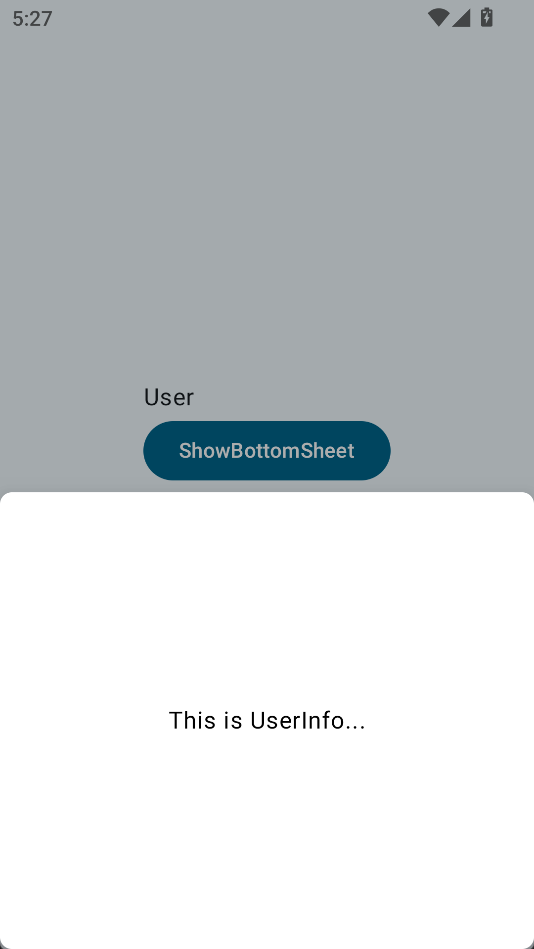

# Voyager
一个 Voyager 演示项目

## HomeTab

`HomeTab` 基础页面

## UserTab

`UserTab` 演示了BottomSheet

## SettingsTab

`SettingsTab` 演示了多层级导航,导航路径也就是 根(SettingsTab) -> SettingsHome -> SettingsAccount -> SettingsNetwork
